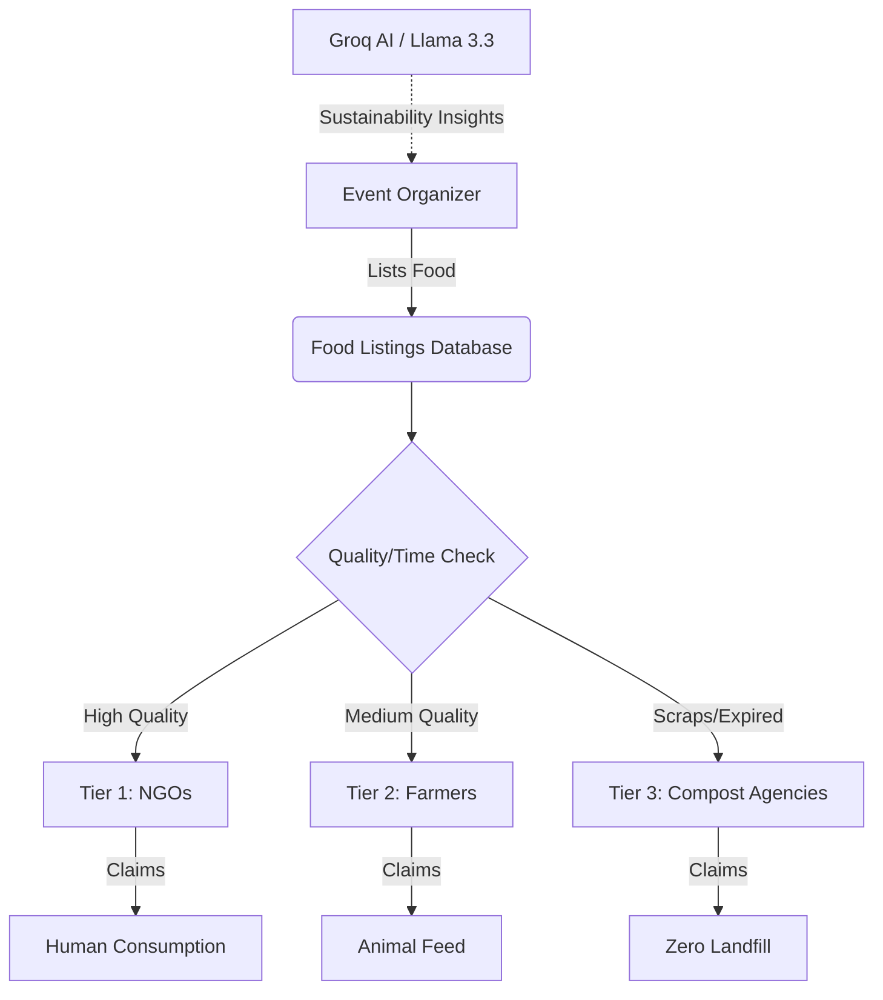

<div align="center">
  
  <h1>🚀 FoodOrbit V2.0</h1>
  <p><strong>A Real-Time Food Rescue & Logistics Platform</strong></p>
  <p>Connecting Event Organizers, NGOs, Farmers, and Compost Agencies to eliminate food waste through an automated, intelligent redistribution network.</p>

  <p>
    <a href="https://food-orbit.vercel.app"><b>Live Demo</b></a> •
    <a href="#-what-it-does"><b>What it does</b></a> •
    <a href="#-architecture--workflow"><b>Architecture</b></a> •
    <a href="#%EF%B8%8F-setup--deployment"><b>Setup</b></a> •
    <a href="#-future-scope"><b>Future Scope</b></a>
  </p>

  <div>
    
    
    
    
    
  </div>
</div>

<br/>

## 🎯 What it does
**FoodOrbit** is an intelligent, cloud-based ecosystem designed to tackle the global problem of food waste. By acting as a real-time bridge, it ensures surplus food from events or large gatherings is dynamically routed to the most appropriate destination before it expires.


Our goal is to **maximize food recovery and prevent landfill waste** using a structured three-tier system.

---

## ✨ Features & User Roles

FoodOrbit operates through role-based access, ensuring a smooth and targeted experience for every participant in the ecosystem.

| Role | Capabilities & Workflow |
| :--- | :--- |
| 🧑‍💼 **Event Organizer** | List surplus food with details (quantity, type, expiry). Get AI-powered sustainability recommendations. |
| 🤝 **NGOs (Tier 1)** | First priority access. Claim high-quality surplus food for **Human Consumption**. |
| 🧑‍🌾 **Farmers (Tier 2)** | Second priority access. Claim remaining food unsuitable for humans for **Animal Feed**. |
| ♻️ **Compost Agencies (Tier 3)** | Final safety net. Claim organic waste for **Composting** to ensure zero landfill impact. |

### 🛠 Core Capabilities
* **Live Dashboard:** Real-time updates on food listings and claims.
* **AI Impact Panel:** Powered by Groq API (Llama 3.3) for generating sustainability recommendations and insights.
* **Tier Filtering:** Automated routing prioritizing human consumption, then animal feed, and finally compost.
* **Role-Based Claim Workflow:** Secure, transactional claim process tied to Firebase Authentication.

---

## 🏗 Architecture & Workflow

The platform leverages a scalable, serverless architecture running on Next.js App Router and Firebase.

### System Workflow



---

## 📂 Detailed Folder Structure

The repository is structured following best practices for Next.js App Router applications, keeping components, utilities, and configuration modular.

```text
foodorbit/
├── src/                    # Core application source code
│   ├── app/                # Next.js App Router pages and layouts
│   │   ├── dashboard/      # Role-based dashboard interfaces
│   │   ├── login/          # Firebase Auth logic and UI
│   │   ├── api/            # Serverless API routes (e.g., AI integration)
│   │   ├── globals.css     # Global Tailwind styles
│   │   └── layout.tsx      # Root layout wrapper
│   ├── components/         # Reusable React components (UI, Modals, etc.)
│   ├── lib/                # Shared utilities and configurations
│   │   ├── firebase.ts     # Firebase initialization and services
│   │   └── ai.ts           # Groq API / AI helper functions
│   └── types/              # TypeScript interfaces and type definitions
├── public/                 # Static assets (images, icons, fonts)
├── firestore.rules         # Security rules for Firestore database
├── .env.local.example      # Example environment variables required
├── next.config.ts          # Next.js configuration settings
├── tailwind.config.ts      # Tailwind CSS configuration
├── tsconfig.json           # TypeScript configuration
└── package.json            # Project dependencies and npm scripts
```

---

## ⚙️ Setup & Deployment

We believe in making it as easy as possible to run this platform locally. Follow the steps below to spin up FoodOrbit on your machine.

### Prerequisites
- [Node.js](https://nodejs.org/) (v18 or higher)
- npm, yarn, pnpm, or bun
- A Firebase Project (with Firestore and Authentication enabled)
- A Groq API Key

### 1. Clone the repository
```bash
git clone https://github.com/Santhoshcv07/Food-Orbit.git
cd Food-Orbit/foodorbit
```

### 2. Install dependencies
```bash
npm install
# or
yarn install
```

### 3. Environment Variables
Create a `.env.local` file in the root of the project and add the following keys. 
*(Replace the values with your actual Firebase configuration and Groq API key)*
```env
NEXT_PUBLIC_FIREBASE_API_KEY=your_api_key
NEXT_PUBLIC_FIREBASE_AUTH_DOMAIN=your_auth_domain
NEXT_PUBLIC_FIREBASE_PROJECT_ID=your_project_id
NEXT_PUBLIC_FIREBASE_STORAGE_BUCKET=your_storage_bucket
NEXT_PUBLIC_FIREBASE_MESSAGING_SENDER_ID=your_messaging_sender_id
NEXT_PUBLIC_FIREBASE_APP_ID=your_app_id

GROQ_API_KEY=your_groq_api_key
```

### 4. Run the Development Server
```bash
npm run dev
```
Open [http://localhost:3000](http://localhost:3000) with your browser to see the result.

### 5. Deployment
The easiest way to deploy this Next.js application is through [Vercel](https://vercel.com/):
1. Push your code to GitHub.
2. Import the project into Vercel.
3. Add the Environment Variables in the Vercel Dashboard.
4. Deploy!

---

## 🚀 Future Scope

The mission to eliminate food waste doesn't stop here. Planned future enhancements include:
* **Geospatial Tracking:** Real-time map integration showing active food listings and routing for claimers.
* **Audit Logging & Activity Tracking:** Enhanced security compliance by logging all user interactions.
* **Logistics Integration:** Partnering with local delivery APIs to automate transport from organizer to claimer.
* **Advanced AI Analytics:** Predictive AI to help event organizers accurately estimate food requirements to prevent surplus entirely.

---

## 💡 Use Cases

* **Large-scale Tech Conferences / Expos:** Often over-cater, leaving vast amounts of untouched food.
* **Wedding Venues & Hotels:** Recurring surplus of high-quality meals suitable for immediate NGO pickup.
* **Supermarkets & Groceries:** Nearing expiration produce can automatically fall into Tier 2 (Farmers) or Tier 3 (Compost).

---

## 🤝 Contribution

We welcome contributions from developers, designers, and sustainability advocates!

1. Fork the Project
2. Create your Feature Branch (`git checkout -b feature/AmazingFeature`)
3. Commit your Changes (`git commit -m 'Add some AmazingFeature'`)
4. Push to the Branch (`git push origin feature/AmazingFeature`)
5. Open a Pull Request

---
<div align="center">
  <p>Built with ❤️ for a sustainable future.</p>
</div>
